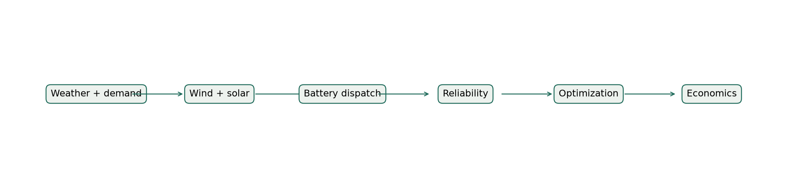
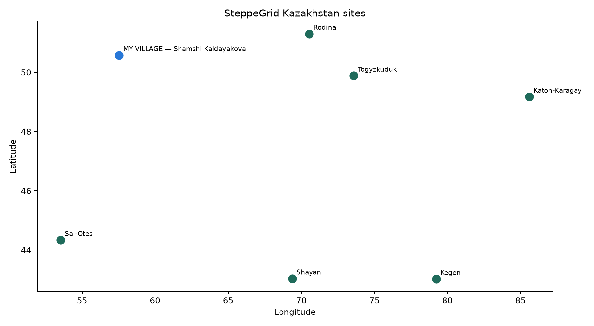
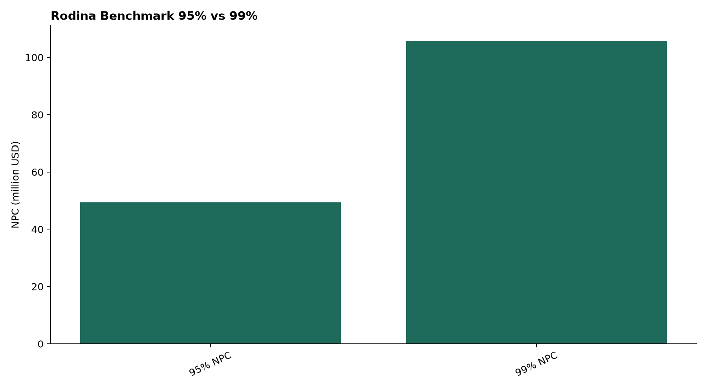
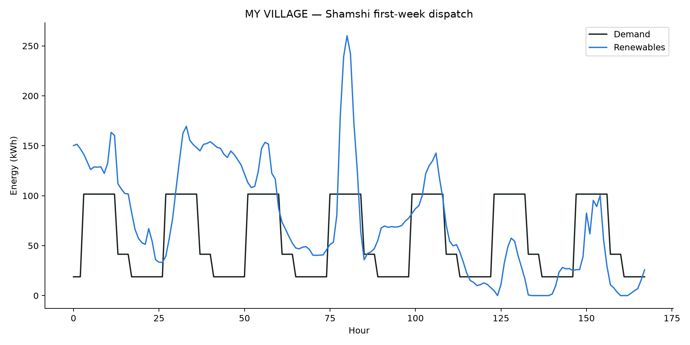

# SteppeGrid

## Renewable Microgrid Planning for Rural Kazakhstan

SteppeGrid is an interactive renewable-energy planning platform that combines hourly weather, electricity demand, wind and solar generation, battery dispatch, reliability targets, optimization, and economics across rural Kazakhstan. It is designed for transparent scenario analysis rather than guaranteed field performance or procurement decisions.

    

**[Interactive Planner](#interactive-planner) · [Final Technical Report](docs/steppegrid_final_report.md) · [Portfolio Summary](docs/steppegrid_portfolio_summary.md) · [Reproducibility](docs/reproduce_steppegrid.md) · [Rodina Benchmark](docs/benchmarks/rodina.md)**



## Why This Project

Rural and remote settlements face energy-planning constraints that differ in demand scale, weather resources, equipment choices, and acceptable shortfall. Renewable microgrids therefore require explicit tradeoffs among generation, storage, reliability, and lifecycle cost. SteppeGrid models those tradeoffs hour by hour, preserving the timing of demand and variable generation. Its outputs are planning scenarios under documented assumptions—not claims of deployed performance.

## Key Capabilities

- Hourly weather inputs and configurable electricity-demand profiles
- Wind-turbine and solar-PV generation modeling
- Battery state-of-charge dispatch with energy and power constraints
- Annual energy-served, unmet-energy, deficit-duration, and curtailment metrics
- Discrete equipment sizing for 95% and 99% annual energy-served targets
- CAPEX, net present cost, equivalent annual cost, and cost-per-served-kWh estimates
- Registered Kazakhstan sites and configurable custom-site workflows
- Downloadable JSON and CSV scenario results

## Key Results

### My Village — Shamshi Kaldayakova

Shamshi Kaldayakova is the featured personal case. SteppeGrid evaluates standardized planning scenarios at both reliability targets using its registered 0.50 GWh/year demand estimate.

| Target | Wind | Solar | Usable storage | Modeled annual energy served | NPC |
|---|---:|---:|---:|---:|---:|
| 95% | 200 kW | 347.8 kWdc | 1.03 MWh | 95.83% | $2.64M |
| 99% | 500 kW | 298.1 kWdc | 1.54 MWh | 99.12% | $4.22M |

### Rodina Benchmark

| Target | Wind | Solar | Usable storage | Modeled annual energy served | NPC | Longest deficit |
|---|---:|---:|---:|---:|---:|---:|
| 95% | 2.04 MW | 8.30 MWac | 15.42 MWh | 95.04% | $49.4M | 41 h |
| 99% | 4.98 MW | 20.20 MWac | 23.12 MWh | 99.00% | $105.8M | 16 h |

The engineering takeaway is direct: under the frozen assumptions, a higher annual energy-served target can require substantially more generation and storage capacity and much higher modeled lifecycle cost. These selected designs are not universal procurement optima or field guarantees.

## Visual Evidence

| Seven registered Kazakhstan sites | Rodina reliability-cost tradeoff |
|---|---|
|  |  |



*Frozen publication figures generated from the documented release artifacts.*

<!-- TODO: add a real Streamlit planner screenshot after one is captured from a verified deployment or local run. -->

## Interactive Planner

Choose a registered or custom site, use registered demand or provide annual, monthly, or hourly demand, select a 95% or 99% annual energy-served target, choose technologies, review the inputs, and run the planner. Optimization starts only after **Run Planner** is selected. Session results can be downloaded as JSON or CSV; hosted environments do not guarantee permanent scenario storage.

## System Architecture

`Data` → `Physical Models` → `Hourly Dispatch` → `Reliability` → `Optimization` → `Economics` → `Streamlit Interface`

- `steppegrid/`: physical models, dispatch, reliability, optimization, economics, registry, and application services
- `data/`: site definitions, demand records, equipment data, and repository-relative weather inputs
- `outputs/`: frozen benchmarks, standardized scenarios, tables, and publication figures
- `app.py`: Streamlit entry point

## Kazakhstan Sites

| Site | Region | Registered annual demand |
|---|---|---:|
| Rodina | Akmola Region | 8.02 GWh/year |
| Shamshi Kaldayakova | Aktobe Region | 0.50 GWh/year |
| Katon-Karagay | East Kazakhstan Region | 2.96 GWh/year |
| Kegen | Almaty Region | 8.00 GWh/year |
| Shayan | Turkistan Region | 8.17 GWh/year |
| Sai-Otes | Mangystau Region | 1.51 GWh/year |
| Togyzkuduk | Karaganda Region | 0.89 GWh/year |

Rodina and Shamshi are contextual cases; the other five sites form the standardized proxy-demand comparison cohort. The figures describe these selected settlements and assumptions, not a national ranking.

## Tech Stack

       

## Scope and Limitations

- Results are modeled planning scenarios, not guaranteed field performance, construction designs, or procurement recommendations.
- Reliability percentages mean annual energy served, not uptime; deficit hours and durations are reported separately.
- The weather record is one year of gridded ERA5 reanalysis, not an on-site measurement campaign.
- Rodina demand is reconstructed from published monthly values; Shamshi and the five-site cohort use declared estimate or proxy assumptions rather than village smart-meter datasets.
- Economic outputs depend on the frozen equipment and cost assumptions.
- Custom-site results depend on user inputs, available weather, demand representation, and current model boundaries.
- The project makes no claim of grid certification, detailed electrical design, equipment siting, or universal real-world optimality.

## Run Locally

Prerequisites: Python 3.12 or newer and [uv](https://docs.astral.sh/uv/).

```bash
git clone https://github.com/Stukhori/SteppeGrid.git
cd SteppeGrid
uv sync --frozen --extra app --extra dev --extra visualization
uv run streamlit run app.py
```

Open `http://localhost:8501` if Streamlit does not open a browser automatically.

## Reproducibility and Validation

The authoritative workflow is in [docs/reproduce_steppegrid.md](docs/reproduce_steppegrid.md). Frozen Rodina artifacts can be checked without changing the selected designs:

```bash
uv run python scripts/run_phase12.py --mode verify
uv run python scripts/run_final_validation.py
uv run pytest
```

The standardized cross-village comparison is stored under `outputs/phase17/` and can be verified with `uv run python scripts/run_phase17.py --verify`.

## Documentation

- [Final technical report](docs/steppegrid_final_report.md)
- [Portfolio summary](docs/steppegrid_portfolio_summary.md)
- [Research abstract](docs/steppegrid_research_abstract.md)
- [Plain-language summary](docs/steppegrid_plain_language_summary.md)
- [Reproduction guide](docs/reproduce_steppegrid.md)
- [Rodina benchmark](docs/benchmarks/rodina.md)
